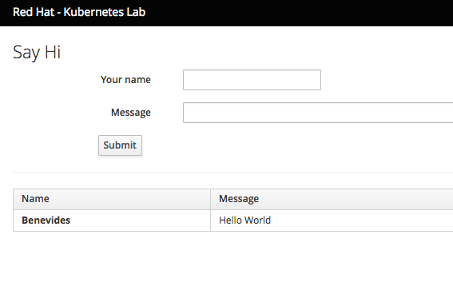

### Accéder au front-end
Duration: 5:00

Kubernetes *ServiceTypes* allow you to specify what kind of service you want. The default and base type is *ClusterIP*, which exposes a service to connection from inside the cluster. *_NodePort_ and _LoadBalancer_ are two types that expose services to external traffic*.

Les *ServiceTypes* de Kubernetes vous permettent de spécifier le type de service que vous souhaitez. Le type par défaut et de base est *ClusterIP*, qui expose un service à une connexion depuis l'intérieur du cluster. *_NodePort_ et _LoadBalancer_ sont deux types qui exposent les services au trafic externe*.

Les valeurs valides pour le champ ServiceType sont :

- *ClusterIP* : utilisez uniquement une adresse IP interne au cluster - il s'agit de la valeur par défaut. Le choix de cette valeur signifie que vous souhaitez que ce service soit accessible uniquement depuis l'intérieur du cluster.

- *NodePort* : en plus d'avoir une adresse IP interne au cluster, exposez le service sur un port sur chaque noeud du cluster (le même port sur chaque noeud). Vous pourrez contacter le service sur n'importe quelle adresse <NodeIP>:NodePort.

- *LoadBalancer* : en plus d'avoir une adresse IP interne au cluster et d'exposer le service sur un NodePort également, demandez au fournisseur de cloud un équilibreur de charge qui transmet au service exposé en tant que <NodeIP> :NodePort pour chaque noeud.

Notez que nous avons spécifié *LoadBalancer*, mais cela ne fonctionne que sur les fournisseurs de cloud qui prennent en charge les équilibreurs de charge externes. Par exemple, dans AWS, GCP, Azure, un équilibreur de charge sera créé de manière asynchrone et une nouvelle adresse IP externe sera attribuée. L'adresse IP externe serait disponible sous le champ *LoadBalancer Ingress*.

POur ouvrir une accès à l'extérieur, noius allons créer une route vers notre service :

[source, bash, subs="normal,attributes"]
----
$ *oc create -f guestbook-route.yml*
route/guestbook-route created
----

SI vous voulez récupérer l'URL de l'application, il suffit de taper la commande :

[source, bash, subs="normal,attributes"]
----
$ *oc get route*
----

Copier l'URL dans votre barre d'adresse de votre navigateur et vous devriez voir quelque chose comme ceci :

