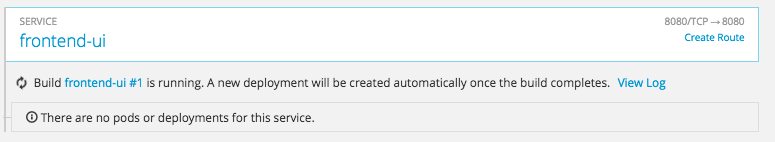

## Bonus
Duration: 10:00

Voici quelques idées pour les prochaines étapes.

### Essayez la fonction OpenShift Source-to-image.

OpenShift vous permet d'obtenir un code source et de le transformer en une image de conteneur. Ceci est très utile pour les personnes qui ne savent pas créer leur propre image. OpenShift détecte automatiquement la langage et utilise un "builder" approprié pour la convertir en une image de conteneur fonctionnelle. Actuellement, les langages suivants sont pris en charge : Ruby, Java, NodeJS, PHP, Python et Go (il doit y en avoir d'autres ...).

Voyons comment cela fonctionne en utilisant le lien : https://github.com/lfranchini31/openshift-training/tree/master/frontend[frontend sources] comme exemple :

Tout d'abord, supprimons le frontal existant *Route*, *Service* et *ReplicationController*

[source, bash, subs="normal,attributes"]
----
$ *oc delete deployment,svc,route frontend-ui*
deployment "frontend-ui" deleted
service "frontend-ui" deleted
route "frontend-ui" deleted

$ *oc new-app --name=frontend-ui \
      https://github.com/lfranchini31/openshift-training \
      --strategy=source  --context-dir=frontend*
--> Found image 0b37bce (5 weeks old) in image stream "openshift/nodejs" under tag "4" for "nodejs"

    Node.js 4
    ---------
    Platform for building and running Node.js 4 applications

    Tags: builder, nodejs, nodejs4

    * The source repository appears to match: nodejs
    * A source build using source code from https://github.com/lfranchini31/openshift-training will be created
      * The resulting image will be pushed to image stream "frontend-ui:latest"
      * Use 'start-build' to trigger a new build
    * This image will be deployed in deployment config "frontend-ui"
    * Port 8080/tcp will be load balanced by service "frontend-ui"
      * Other containers can access this service through the hostname "frontend-ui"

--> Creating resources ...
    imagestream "frontend-ui" created
    buildconfig "frontend-ui" created
    deploymentconfig "frontend-ui" created
    service "frontend-ui" created
--> Success
    Build scheduled, use 'oc logs -f bc/frontend-ui' to track its progress.
    Run 'oc status' to view your app.
----

Cela déclenchera le build à l'intérieur d'OpenShift. Vous pouvez l'explorer à l'aide des commandes suivantes :

[source, bash, subs="normal,attributes"]
----
$ *oc get builds*
NAME            TYPE      FROM          STATUS    STARTED              DURATION
frontend-ui-1   Source    Git@e09f71e   Running   About a minute ago   1m23s

$ *oc logs -f bc/frontend-ui*
----

Vous pouvez également voir la compilation se dérouler dans la console OpenShift :

N'oubliez pas d'exposer la *Route* et essayez l'application. Vous souvenez-vous comment faire, n'est-ce pas ?

### Construire une nouvelle version.

When OpenShift is installed in a public address, you can enable link:https://developer.github.com/webhooks/[Github webhooks] that triggers a new OpenShift build each commit. This is useful for Continuous Integration environments. You can read more about it in the following link:https://docs.openshift.com/container-platform/3.11/dev_guide/builds/triggering_builds.html[guide].

Vous pouvez également déclencher un nouveau build à l'aide de la commande *oc start-build <buildname>*. Il vous permet de spécifier un emplacement différent pour les sources. Essayez-le vous-même ! Clonez le référentiel ou apportez une modification locale et exécutez la commande.

Some examples that you can try.

NOTE: Pour construire à partir de local, vous devez vous trouver à la racine du repository (openshift-training) car vous avez déjà spécifié le paramètre --context-dir=frontend.

[source, bash, subs="normal,attributes"]
----
$ cd openshift-training/
$ *oc start-build frontend-ui \
          --from-dir=. \
          --follow*
Uploading directory "." as binary input for the build ...
frontend-ui-?
----

Vous pouvez également construire à partir de sources Github

[source, bash, subs="normal,attributes"]
----
$ *oc start-build frontend-ui \
         --git-repository=https://github.com/lfranchini31/openshift-training \
         --follow*
frontend-ui-?
I0804 08:03:45.260863       1 source.go:197] Downloading "https://github.com/lfranchini31/openshift-training" ...
----
