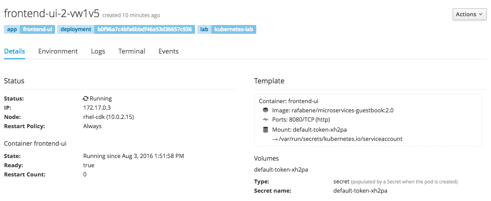
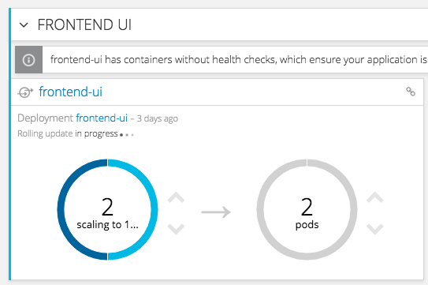

### La console OpenShift
Duration: 10:00

Jusqu'à présent, nous utilisions OC CLI (_oc_) pour gérer notre cluster. Ne serait-il pas bon de pouvoir visualiser/gérer notre cluster dans un utilisateur/une interface ?

Jetons un coup d'œil dans la console OpenShift.

NOTE: OpenShift s'exécute au-dessus de Kubernetes mais ajoute des fonctionnalités telles que les DeploymentConfig, le source-to-image, la gestion des utilisateurs, les routes, etc.

Tout ce que l'on a fait en ligne de commande , nous pouvons le faire avec al conseole OpenShift.

Activez le profil Adminstrateur (en haut à gauche) si ce n'est pas fait déjà (normalement, par défaut).

Prenez quelques minutes pour explorer l'interface.

- Cliquez sur les liens Service et Déploiement et consultez les détails.
- Cliquez sur le numéro de POD et consultez la liste des PODS. Sélectionnez un POD à explorer.
- Explorez les détails du POD et les autres onglets (Environnement, Journaux, Terminal et Événements)
- Dans le coin supérieur droit, cliquez sur le bouton gris _Actions_ et vérifiez que vous pouvez également modifier le fichier YAML.

NOTE: Les barres bleues au-dessus des pods sont des "filtres d'étiquettes" qui ont été appliqués pour sélectionner uniquement les pods spécifiques pour le *ReplicationController* sur lequel vous avez cliqué.

Revenez à la page *Aperçu* et vérifiez que vous pouvez augmenter et réduire le nombre de pods simplement en cliquant sur les flèches grises à droite du nombre de pods.

Effectuons une mise à jour progressive (rolling-update) dans le shell et voyons comment il se comporte visuellement dans OpenShift. Exécutez la commande suivante et revenez à la console OpenShift dans le navigateur :

[source, bash, subs="normal,attributes"]
----
$ *kubectl set image  deployment/frontend-ui frontend-ui=rafabene/microservices-frontend:1.0*
deployment.extensions/frontend-ui image updated
----

Bon, quand vous aurez regarder la partie Workload, nous pourrons voir ensemble le reste ...
