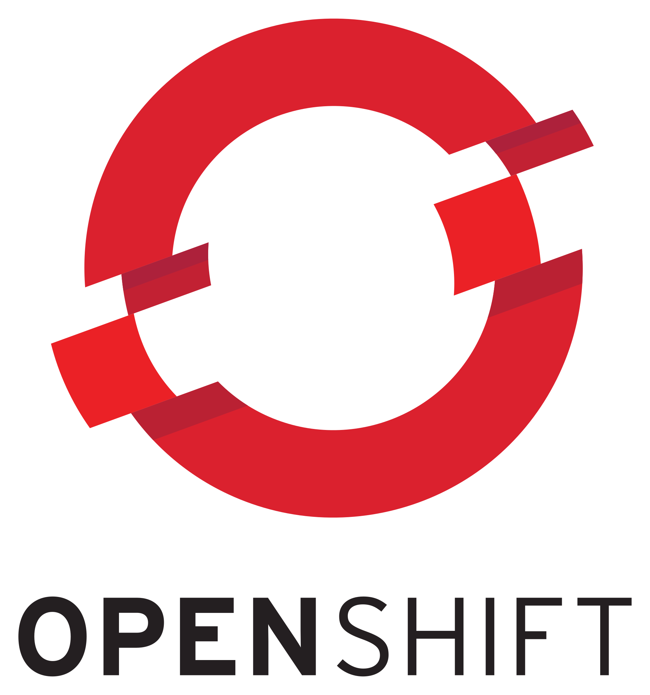

:doctitle: OpenShift Lab pour la SandBox Dev
:doctype: book
:toc: macro
:toc-title: Sommaire
:toclevels: 5
ifdef::backend-pdf[]
:title-logo-image: 
:pdf-page-size: A4
endif::[]
:icons: font
:data-uri:
:source-highlighter: highlightjs
:numbered:
:revnumber: 1.0.0
:revdate: {docdatetime}
:revremark: Les labs pour bien débuter sur OpenShift !

= {doctitle}

toc::[]

## OpenShift - les bases

Nous allons travailler sur cet exemple https://github.com/lfranchini31/openshift-training [Guestbook]. Cet exemple a une interface utilisant HTML5 et Javascript (côté client et côté serveur), et deux microservices construits à l'aide du lien : http://wildfly-swarm.io[WildFly Swarm] et du lien : http://vertx.io/[VertX]. Il nécessite MySQL pour stocker les entrées du livre d'or.

image::images/app-diagram.png[Logo,float="center",align="center"]

include::app-application-source.adoc[]

include::app-frontend-deployment.adoc[]

include::app-frontend-service.adoc[]

include::app-deploy-mysql-and-service.adoc[]

include::app-deploy-microservices.adoc[]

include::external-access.adoc[]

include::scaling.adoc[]

include::health-checks.adoc[]

include::rolling-update.adoc[]

include::graceful-shutdown.adoc[]

## OpenShift - Pour aller plus loin ...

include::openshift.adoc[]

include::configuring-application.adoc[]

include::managing-credentials.adoc[]

include::autoscaling.adoc[]

include::extra.adoc[]

include::references.adoc[]
